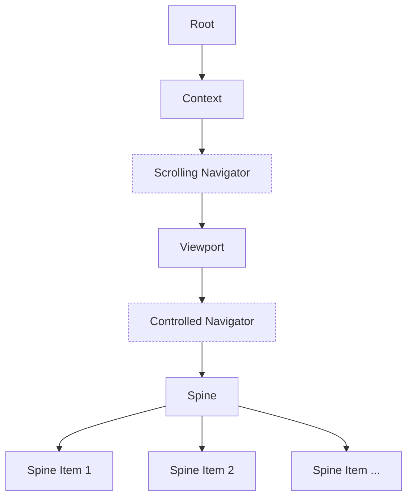

# Internal structure

Simplified representation of the internal components structure. This can help you understand the flow of data and how to retrieve specific parts of the reader. There are more components internally but these are the important layers you need to be familiar with.

